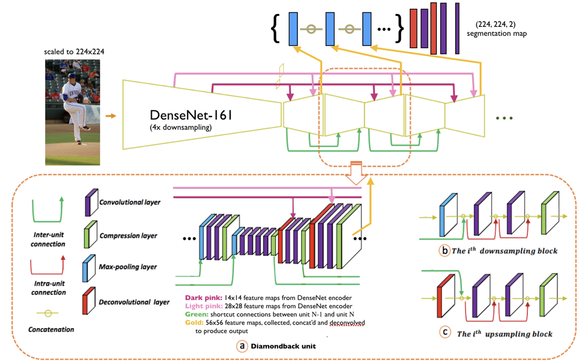

# segmentation-191 (Diamondback)
Human body segmentation project for CS 191, Senior research project.

```sample-backpack```: A set of sample images from MS COCO.
```scripts```: Scripts used to test, process data, add regularization, etc.   
```assets```: Poster describing this project in more detail, images and resources.   
```assets/output_imgs```: Predicted segmentation masks for COCO samples in ```sample-backpack```.   
```model```: Code relating to the Diamondback model itself; architecture, losses, DenseNet encoder.   
```logs```: Keras training logs over the 19 epochs. Zipped.    
```util```: Code for data generators, common paths.   
```weights```: Location where Diamondback model weights will be stored and loaded from.   
```tmp```: Misc directory to store things when debugging, used in test scripts.   

### Usage:
Download the model weights (not in Github because of size):   
```python3 download_diamondback_weights.py```   
_-> weights/diamondback\_{...}.h5_   
_-> model/densenet_encoder/encoder_model.h5_   

Run a demo prediction:   
```python3 predict.py --demo --load_path weights/diamondback_{...}.h5```   

Train:   
```python3 training.py [--debug] [--load_path weights/diamondback_{...}.h5]```    

### Notes:
To run certain data scripts, make sure to install (or be in a virtualenv with) the COCO API.   
Some paths (namely ```util/pathutil.py```, shell scripts in ```tmp```) are hardcoded for FloydHub's environment, where data and model weights were expected to be at the drive root ```/```.   

## Diamondback Model Overview
Inspiration mostly from Fu et al. in "SDN for Semantic Segmentation" (https://arxiv.org/abs/1708.04943, 2017).   
We trained Diamondback M2, which is two encoder-decoder units. More units would increase the number of parameters, but may improve results.    
* Each unit employs dense convolutional connections.
* inter-unit connections: Decoder feature maps at unit N-1 are concat'd with the encoder feature maps of the same resolution at unit N.
* DenseNet encoder: We transfer learn by using DenseNet-161's layers as the first unit's encoder.
    * 28x28 and 56x56 feature maps from the DN encoder are convolved and concat'd to every other unit's decoder layers of the respective resolution.
* Using all units' learned decoder outputs: We concatenate all units' decoder outputs (56x56), then upsample up to 224x224 for a final prediction tensor with 2 channels.



## Training History
Losses and IOU over 19 epochs of training.

 

## Sample Images
Columns left to right: (1) Image, (2) Diamondback M2 model's prediction, (3) Ground truth segmentation masks.

  

  

  

  

  

  

  

  

  

  

  

  

  

  

  

  
