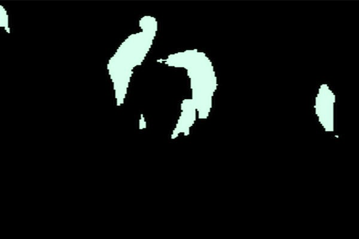
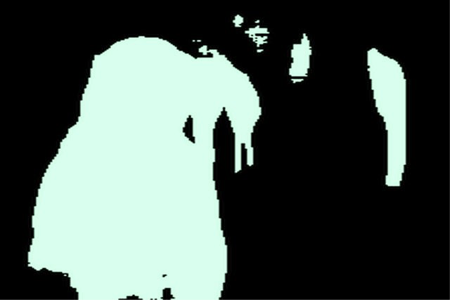
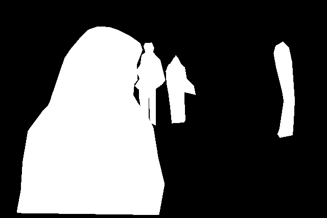
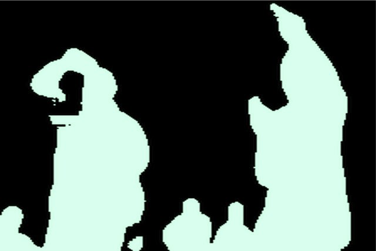
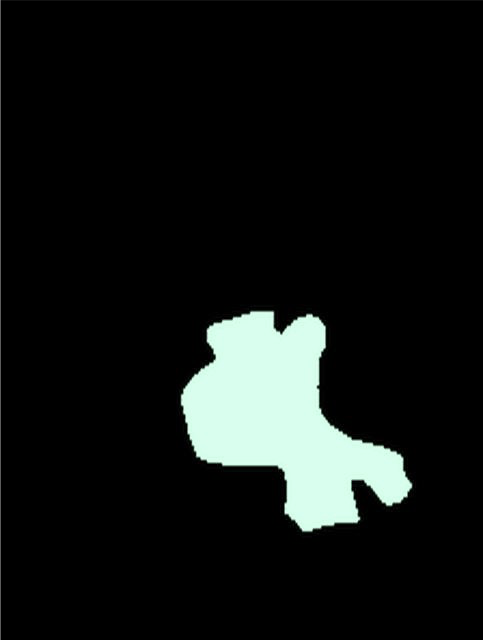
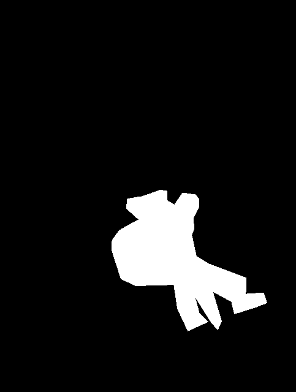
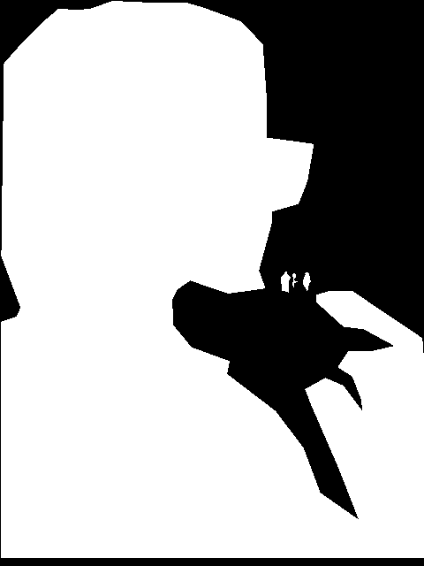
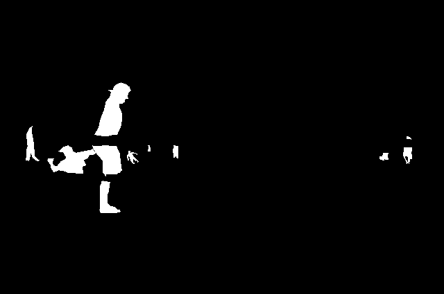

# segmentation-191
Human body segmentation project for CS 191 (Diamondback), Senior research project.

To run data scripts, make sure to install (or be in a virtualenv with) the COCO API.

See ```assets``` for poster describing this project in more detail.

-- ojwang@cs.stanford.edu

## Training History
Losses and IOU over 19 epochs of training.

 

## Sample Images
Columns left to right: (1) Image, (2) Diamondback M2 model's prediction, (3) Ground truth segmentation masks.

  

  

  

  

  

  

  

  

  

  

  

  

  

  

  

  